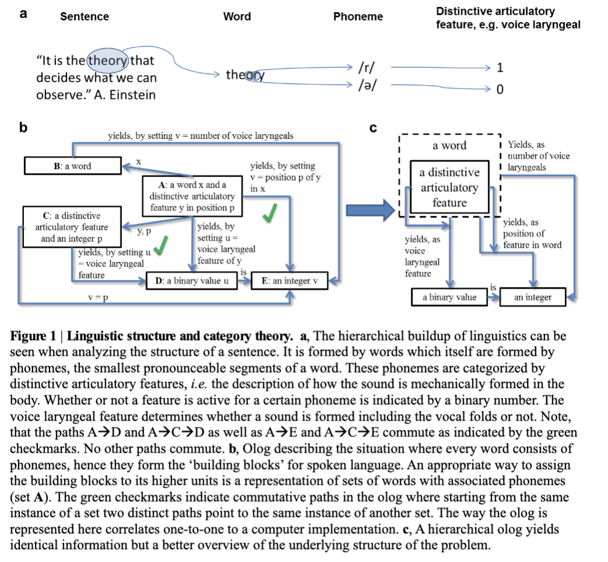
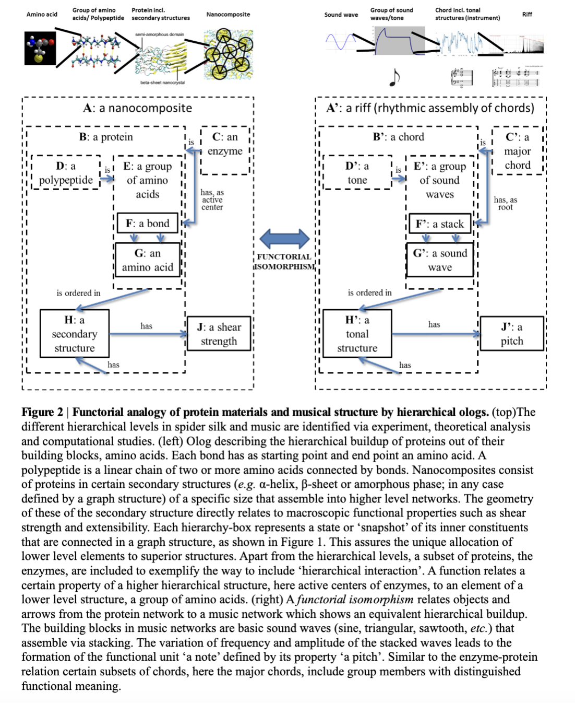

# Hyperplex
The project Hyperplex involves creating multimodal [machine-readable memeplexes](https://web.archive.org/web/20230314182803/http://www.susanblackmore.uk/wp-content/uploads/2017/05/JCS03.pdf) represented as directed hypergraph ontology logs. lol.

Best used with a gnn for which you have many options:
- [Ontology Management Engine](https://github.com/cyber-phys/ontology)
- [Ultra](https://github.com/DeepGraphLearning/ULTRA)
- ~[GNN-QE](https://github.com/cyber-phys/GNN-QE)~

## Crash Course on Ologs
[Ontology logs (ologs)](https://math.mit.edu/~dspivak/informatics/olog.pdf) are conceptual frameworks for organizing and representing knowledge in a structured and categorical way. They leverage the principles of category theory to create a map of interconnected concepts and relationships. In an olog, entities and their interrelations are precisely defined, with emphasis on clear and functional connections. This structured approach enables the creation of a rigorous and reusable knowledge base. Ologs are particularly useful for representing complex domains of knowledge in a way that is both precise and adaptable, allowing for the integration of new information and the connection of disparate ideas. They can be especially beneficial in scientific and academic contexts where clear, systematic representation of complex information is crucial.

[Ologs enable the construction of cross-domain analogies](https://arxiv.org/abs/1111.5297) that systematically map out nuanced relationships within a memeplex, allowing for machine-readable and multi-layered analysis of information.


*Ologs applied to generative linguistics*


*Ologs used to form cross domain functorial analogies*

# Usage
Install [babaska](https://babashka.org)
## Set api keys
```
export OPEN_AI_KEY=""
expprt REPLICATE_API_TOKEN=""
```
## Loading arxiv papers into the DiHypergraph
This script integrate scholarly papers from arXiv into the DiHypergraph, enriching your memeplex with cutting-edge research and perspectives.
```
bb olog.clj https://arxiv.org/pdf/1102.1889.pdf
```
## Loading User Session into the DiHypergraph
This script captures screenshots at regular 5-second intervals and integrates them into a dynamic DiHypergraph. Each captured image undergoes semantic label generation using the powerful gpt-4-vision model, enriching the data with meaningful context and information.
```
bb auto-capture.clj
```

# Roadmap
Work is on going. The primary challenge is representing the geometry of information in the ontology graph consistently.

Feel free to make a PR if you have any ideas, email me at luc@sanative.ai if you wish to discuss further.

- [x] Add screen grabs to hypergraph
- [x] Add arXiv papers to the hypergraph
- [ ] Consistent formating of the ologs.

# Other attempts at constructing ologs with llms:
- [Olog Debate](https://github.com/cyber-phys/olog-debate)
- [olog-py](https://github.com/Continuum-Corporation/olog)

# Blog Posts on OLOGS:
- [An Intro into Ontology Logs (Ologs)](https://cyber-phys.com/blog/olog/)
- [Knowledge Graphs and Ologs: Enhancing AI Safety through Debate and Ontological Commitments](https://cyber-phys.com/blog/ai-alignment-through-ologs/)
